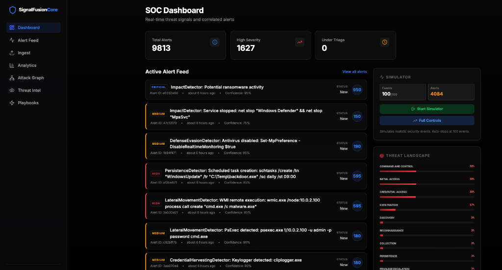
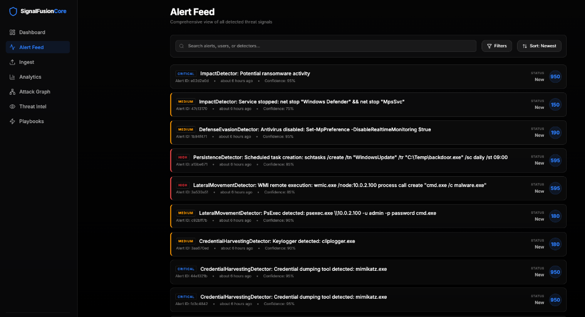
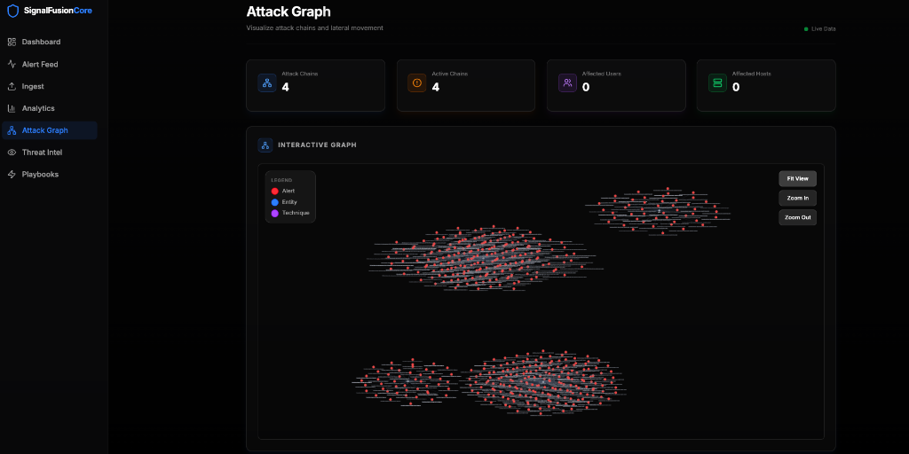
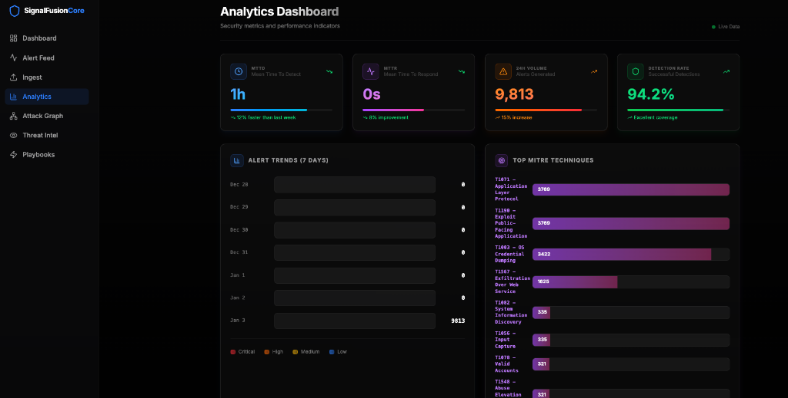
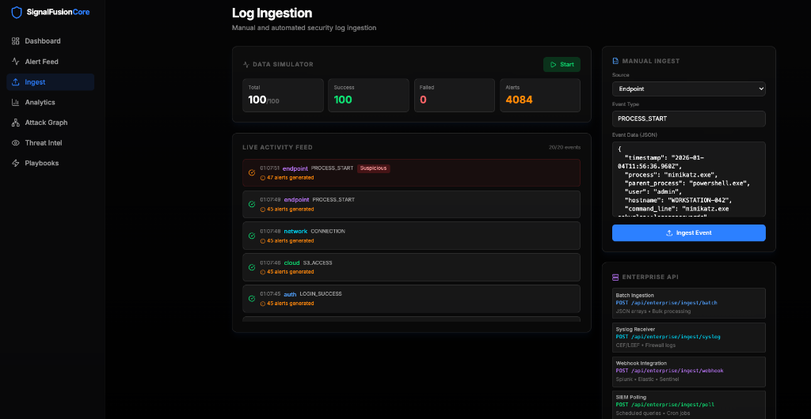
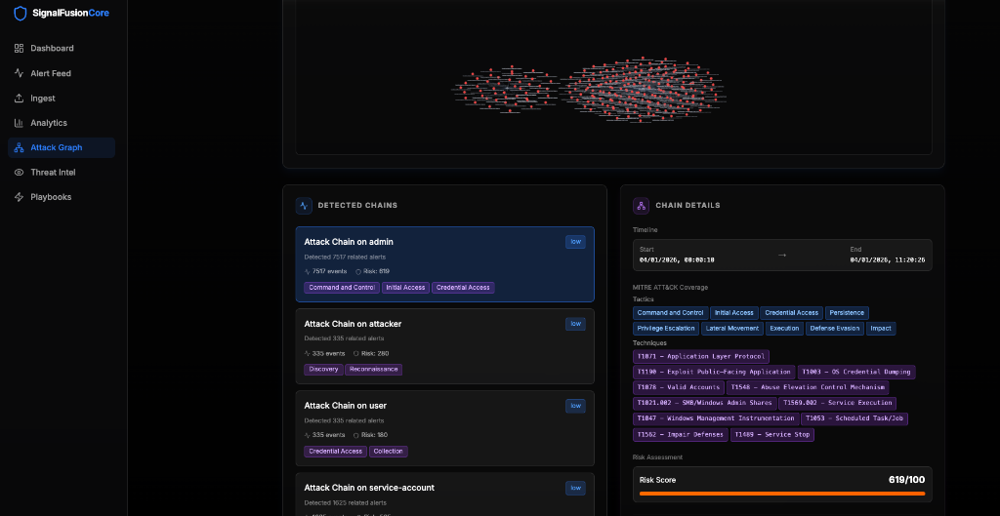
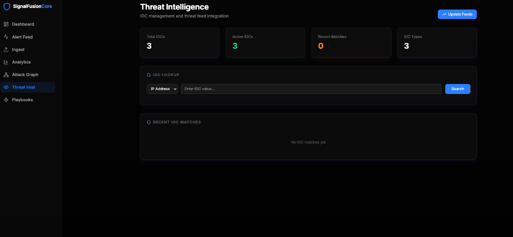
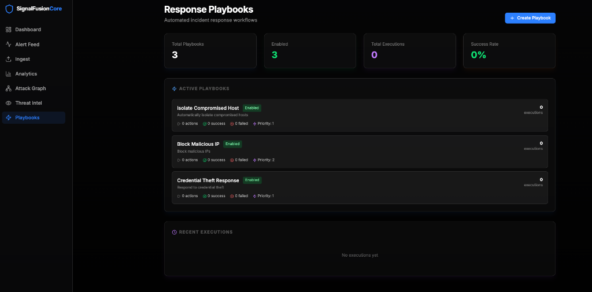
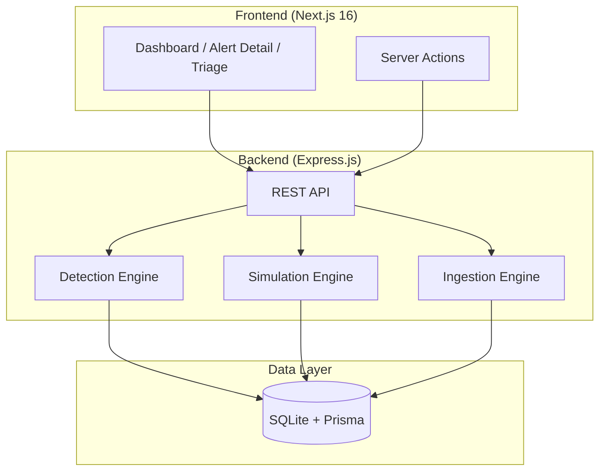

# SignalFusion Core

**High-Fidelity Threat Signal Correlation and Alert Triage Engine**



A comprehensive Security Operations Center (SOC) platform for threat detection, MITRE ATT&CK mapping, and security analyst training.

---

## 🎯 Key Features

<div align="center">
  
  
  
  
  
  
  
</div>

- **48 Diverse Attack Scenarios** across all 13 MITRE ATT&CK tactics.
- **4 Advanced Detectors**: Geo-Velocity, FSM Chain, Anomalous Action, and Threat Intel.
- **MITRE ATT&CK Integration**: Automatic tactic and technique mapping.
- **Attack Path Visualization**: Visual reconstruction of attack stages.
- **Remediation Workflows**: Interactive response orchestration.
- **Threat Landscape Dashboard**: Real-time tactical distribution.
- **Multiple Ingestion Methods**: REST API, Batch, Simulation, Programmatic, and SIEM.

---

## 🚀 Quick Start

### Using Docker (Recommended)

```bash
# Clone repository
git clone <repository-url>
cd "SignalFusion Core"

# Start with Docker Compose
docker-compose up --build
```

**Access**:
- Frontend UI: [http://localhost:3000](http://localhost:3000)
- Backend API: [http://localhost:8001](http://localhost:8001)

### Manual Setup
For manual development setup, please refer to the **[Installation Guide](docs/RUNNING.md)**.

---

## 📚 Documentation

Detailed guides and documentation are located in the `docs/` directory:

- 📖 **[How to Run](docs/RUNNING.md)** - Getting started and installation guide.
- 🏗️ **[Architecture](docs/ARCHITECTURE.md)** - Tech stack, project structure, and technical vision.
- 🎯 **[Detection Engine](docs/DETECTION_ENGINE.md)** - Logic, risk scoring, and attack path mapping.
- 📥 **[Ingestion Guide](docs/INGESTION.md)** - REST API, enterprise intake, and field references.
- 🛡️ **[Operations Guide](docs/OPERATIONS.md)** - Triage workflows, playbooks, and response simulation.
- � **[Deployment](docs/DEPLOYMENT.md)** - Docker setup and troubleshooting.
- 🧪 **[Test Results](docs/TESTING.md)** - Verification and performance testing results.

---

## 🏗️ Architecture



---

## 🛠️ Technology Stack

**Backend**: Nodes.js 20, Express.js, TypeScript, Prisma ORM, SQLite.
**Frontend**: Next.js 16 (App Router), React 19, Tailwind CSS v4, Lucide Icons, Cytoscape.js.

---

## 📂 Project Structure

```text
SignalFusion Core/
├── backend/              # Express.js API & Detection Engines
│   ├── prisma/           # Database Schema & Migrations
│   └── src/              # Source code (detection, simulation, services)
├── frontend/             # Next.js UI & Dashboard
│   └── src/              # Source code (app router, components)
├── docs/                 # Project documentation & guides
├── docker-compose.yml    # Docker orchestration
└── README.md             # Project overview
```

---

## 🧪 Usage Examples

### Run Attack Simulation
```bash
# 10 random scenarios
curl -X POST 'http://localhost:8001/api/simulation/run?count=10'
```

### Ingest Custom Logs
```bash
curl -X POST http://localhost:8001/api/ingest \
  -H "Content-Type: application/json" \
  -d '{"source": "auth", "data": {"user": "admin", "result": "SUCCESS"}}'
```

---

## 🛡️ MITRE ATT&CK Coverage

SignalFusion Core provides extensive coverage across the MITRE ATT&CK framework with **48 unique attack scenarios**.

| Tactic | Scenarios | Tactic | Scenarios |
|--------|-----------|--------|-----------|
| Initial Access | 5 | Discovery | 4 |
| Execution | 4 | Lateral Movement | 4 |
| Persistence | 5 | Collection | 3 |
| Privilege Escalation | 4 | Exfiltration | 3 |
| Defense Evasion | 5 | Command & Control | 3 |
| Credential Access | 5 | Impact | 3 |

---

## 🤝 Contributing & Support

- **Support**: For detailed documentation, see the **[Architecture](docs/ARCHITECTURE.md)**, **[Ingestion](docs/INGESTION.md)**, and **[Operations](docs/OPERATIONS.md)** guides.
- **License**: This project is for educational and demonstration purposes.

---

© 2026 SignalFusion Core Team
