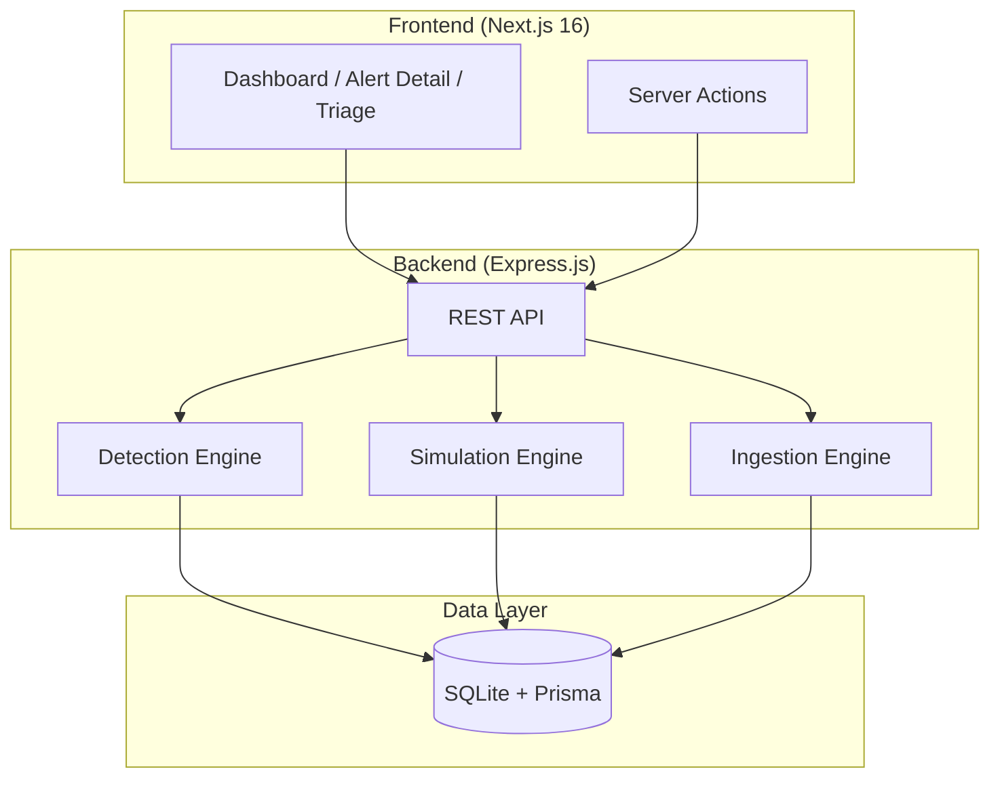
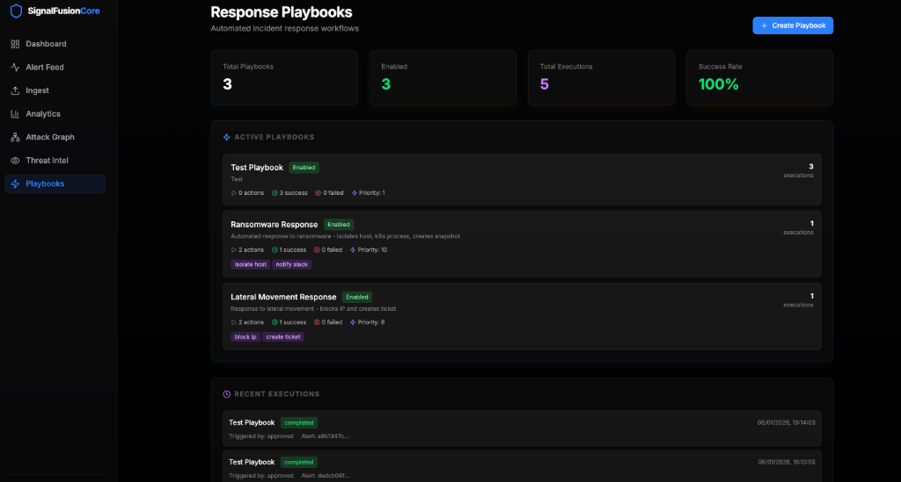
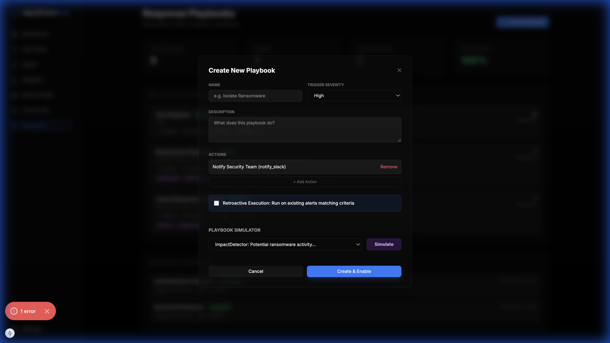
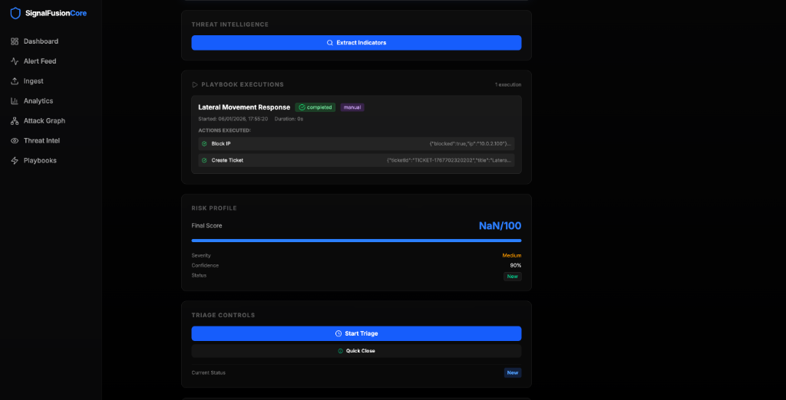

# SignalFusion Core

**High-Fidelity Threat Signal Correlation and Alert Triage Engine**


A comprehensive Security Operations Center (SOC) platform for threat detection, MITRE ATT&CK mapping, and security analyst training.

---

## 🎯 Key Features

<div align="center">
  
  
  
  
  
  
  
</div>

- **48 Diverse Attack Scenarios** across all 13 MITRE ATT&CK tactics.
- **4 Advanced Detectors**: Geo-Velocity, FSM Chain, Anomalous Action, and Threat Intel.
- **MITRE ATT&CK Integration**: Automatic tactic and technique mapping.
- **Attack Path Visualization**: Visual reconstruction of attack stages.
- **Automated Response Playbooks**: Auto-execute incident response workflows with approval controls.
- **Threat Intelligence Integration**: VirusTotal and AbuseIPDB indicator checking with caching.
- **Remediation Workflows**: Interactive response orchestration.
- **Threat Landscape Dashboard**: Real-time tactical distribution.
- **Multiple Ingestion Methods**: REST API, Batch, Simulation, Programmatic, and SIEM.

---

## 🚀 Quick Start

### Using Docker (Recommended)

```bash
# Clone repository
git clone https://github.com/DHARANI2D/SignalFusionCore.git
cd SignalFusionCore

# Start with Docker Compose
docker-compose up --build
```

**Access**:
- Frontend UI: [http://localhost:3000](http://localhost:3000)
- Backend API: [http://localhost:8001](http://localhost:8001)

### 🚀 automated Demo Hosting (One-Click)
For a fully automated deployment including health checks and cleanup:
```bash
./host-demo.sh
```

### Manual Setup
For manual development setup, please refer to the **[Installation Guide](docs/RUNNING.md)**.

---

## 📚 Documentation

Detailed guides and documentation are located in the `docs/` directory:

- 📖 **[How to Run](docs/RUNNING.md)** - Getting started and installation guide.
- 🏗️ **[Architecture](docs/ARCHITECTURE.md)** - Tech stack, project structure, and technical vision.
- 🎯 **[Detection Engine](docs/DETECTION_ENGINE.md)** - Logic, risk scoring, and attack path mapping.
- 📥 **[Ingestion Guide](docs/INGESTION.md)** - REST API, enterprise intake, and field references.
- 🛡️ **[Operations Guide](docs/OPERATIONS.md)** - Triage workflows, playbooks, and response simulation.
- � **[Deployment](docs/DEPLOYMENT.md)** - Docker setup and troubleshooting.
- 🧪 **[Test Results](docs/TESTING.md)** - Verification and performance testing results.

---

## 🏗️ Architecture



---

## 🛠️ Technology Stack

**Backend**: Node.js 20, Express.js, TypeScript, Prisma ORM, SQLite, Axios.
**Frontend**: Next.js 15 (App Router), React 18, Tailwind CSS v4, Lucide Icons, Cytoscape.js.
**Integrations**: VirusTotal API, AbuseIPDB API.

---

## 📂 Project Structure

```text
SignalFusion Core/
├── backend/              # Express.js API & Detection Engines
│   ├── prisma/           # Database Schema & Migrations
│   └── src/              # Source code (detection, simulation, services)
├── frontend/             # Next.js UI & Dashboard
│   └── src/              # Source code (app router, components)
├── docs/                 # Project documentation & guides
├── docker-compose.yml    # Docker orchestration
└── README.md             # Project overview
```

---

## 🧪 Usage Examples

### Run Attack Simulation
```bash
# 10 random scenarios
curl -X POST 'http://localhost:8001/api/simulation/run?count=10'
```

### Ingest Custom Logs
```bash
curl -X POST http://localhost:8001/api/ingest \
  -H "Content-Type": "application/json" \
  -d '{"source": "auth", "data": {"user": "admin", "result": "SUCCESS"}}'
```

### Create Response Playbook
```bash
curl -X POST http://localhost:8001/api/playbooks \
  -H "Content-Type: application/json" \
  -d '{
    "name": "Ransomware Response",
    "description": "Automated response to ransomware detection",
    "trigger": "{\"severity\": \"Critical\"}",
    "enabled": true,
    "autoExecute": true,
    "requireApproval": false,
    "actions": [
      {"name": "Isolate Host", "actionType": "isolate_host", "parameters": "{}", "order": 0},
      {"name": "Notify Team", "actionType": "notify_slack", "parameters": "{\"channel\": \"#security\"}", "order": 1}
    ]
  }'
```

### Check Threat Intelligence
```bash
# Check IP reputation
curl "http://localhost:8001/api/threat-intel/check-ip?ip=8.8.8.8"

# Check file hash
curl "http://localhost:8001/api/threat-intel/check-hash?hash=44d88612fea8a8f36de82e1278abb02f"
```

---

## 🤖 Automated Response Playbooks

SignalFusion Core features a comprehensive playbook automation system that enables SOC teams to automate incident response workflows while maintaining human oversight for critical decisions.

### Key Capabilities

- **Auto-Execution**: Playbooks automatically run when matching alerts are created
- **Approval Workflow**: Human-in-the-loop authorization for sensitive actions
- **Execution History**: Complete audit trail of all playbook runs
- **Playbook Simulator**: Test workflows against existing alerts before deployment
- **Retroactive Execution**: Run playbooks on historical alerts for threat hunting

### Playbook Management

<div align="center">
  
  <p><em>Playbook management dashboard with statistics and execution history</em></p>
</div>

**Features**:
- Real-time statistics (total playbooks, success rate, executions)
- Enable/disable playbooks with one click
- Priority-based execution ordering
- Action preview and configuration

### Playbook Creation

<div align="center">
  
  <p><em>Interactive playbook creation with built-in simulator</em></p>
</div>

**Creation Features**:
- Visual action builder with drag-and-drop ordering
- Trigger condition configuration (severity, techniques, risk score)
- Built-in playbook simulator to test against existing alerts
- Retroactive execution option for historical alerts

### Alert Integration

<div align="center">
  
  <p><em>Playbook execution history and pending approvals in alert details</em></p>
</div>

**Alert Features**:
- **Pending Approvals**: Highlighted section for playbooks requiring authorization
- **Execution History**: Timeline of all playbook runs for the alert
- **Action Results**: Detailed view of executed actions with success/failure status
- **One-Click Approval**: Approve or reject playbooks directly from alert details

### Available Actions

- `isolate_host` - Quarantine infected machines from network
- `block_ip` - Block malicious IPs at firewall
- `notify_slack` - Send alerts to Slack channels
- `create_ticket` - Generate incident tickets
- `kill_process` - Terminate malicious processes
- `collect_logs` - Gather forensic evidence

### Example Playbooks

**Ransomware Response**:
1. Isolate infected host
2. Terminate ransomware process
3. Create forensic snapshot
4. Notify security team

**Lateral Movement Response**:
1. Block source IP address
2. Disable compromised account
3. Create incident ticket
4. Collect security logs

---

## 🔍 Threat Intelligence Integration

Integrated threat intelligence checking with caching for performance:

- **VirusTotal**: IP, hash, domain, and URL reputation checks
- **AbuseIPDB**: IP abuse confidence scoring
- **Caching**: 24-hour cache to reduce API calls and respect rate limits
- **Indicator Extraction**: Automatic detection of IPs, hashes, domains, URLs from alerts

---

## 🛡️ MITRE ATT&CK Coverage

SignalFusion Core provides extensive coverage across the MITRE ATT&CK framework with **48 unique attack scenarios**.

| Tactic | Scenarios | Tactic | Scenarios |
|--------|-----------|--------|-----------|
| Initial Access | 5 | Discovery | 4 |
| Execution | 4 | Lateral Movement | 4 |
| Persistence | 5 | Collection | 3 |
| Privilege Escalation | 4 | Exfiltration | 3 |
| Defense Evasion | 5 | Command & Control | 3 |
| Credential Access | 5 | Impact | 3 |

---

## 🤝 Contributing & Support

- **Support**: For detailed documentation, see the **[Architecture](docs/ARCHITECTURE.md)**, **[Ingestion](docs/INGESTION.md)**, and **[Operations](docs/OPERATIONS.md)** guides.
- **License**: This project is for educational and demonstration purposes.

---

© 2026 SignalFusion Core Team
